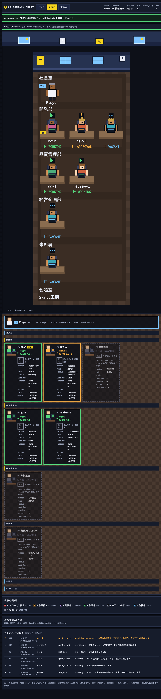
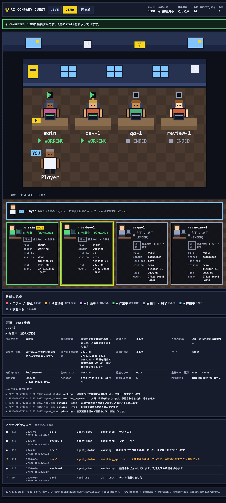
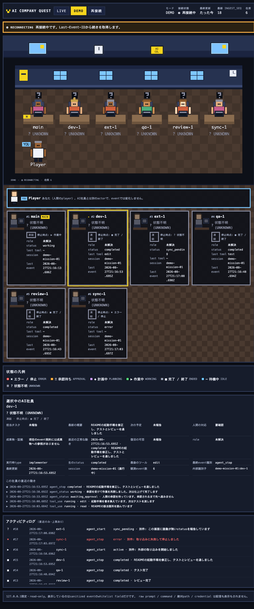

# AI Company Quest

AI Companyの稼働状況をレトロゲーム風UIで可視化するアプリケーション。

このrepositoryは **Collector / SSE / 共有Reducer のcore** と、その上に載る
**レトロオフィス画面のMVP** を実装しています。`npm run live` でCollector・SSE・画面が
同時に起動し、`http://127.0.0.1:4317/` をブラウザで開くとAI社員の状態が1画面で見えます。
画面はbrowser-nativeなHTML/CSS/ES moduleだけで書かれており、依存パッケージはゼロのままです。

---

## クイックスタート（5分）

LIVE入力もcredentialも外部networkも要りません。この5行だけで動きます。

```bash
node -v                     # 1. v22.18.0 以上であることを確認
npm run demo                # 2. 起動（依存のinstallは不要です）
open http://127.0.0.1:4317/#demo   # 3. ブラウザで開く
                            # 4. 「承認待ち ‼」で止まったら、起動したterminalで
                            #    approve と入力して Enter（これが承認です）
                            # 5. 止めるときは起動したterminalで Ctrl-C
```

**開いてから何が見えるか**

ブラウザで開くと、そこから約1.2秒後にミッションが動き始めます（開くまで始まりません）。
リロードは不要で、1.5秒ごとに1手ずつ進みます。

1. `dev-1` が **計画中 ◆** になる
2. **作業中 ▶** に変わり、`last tool` が `read` → `edit` と動く
3. `qa-1` がテスト、`review-1` がレビューに入る
4. `dev-1` が **承認待ち ‼** で止まり、**そこで待ち続けます**
   （**時間では解けません**。待っている間はtimerも張られていないので、放置しても勝手に進みません）
5. 起動したterminalで `approve` + Enter と入力すると、その入力が次のeventを投入します。
   **作業中 ▶** に戻り、最後に **完了 ■** になります
6. 横で **開発部の `開発担当` の席が エラー ✖** になる
   `dev-1` と `sync-1` は同じ `runtime_agent_type`（`implementer`）なので、
   **1つの固定席にまとまります**。席は社員に属していて、sessionごとには増えません。
   席が出すのは、その席にいる全員のうち**いちばん注意が要る状態**です。
   だから `sync-1` がエラーになると席はエラーになり、先に完了した `dev-1` が
   それを覆い隠すことはありません。何人が後ろにいるかは、その席のカードの
   `actors` 行で分かります（ここでは `2`）。`sync-1` が別の社員として
   `未所属` にもう1人現れることはありません。
7. `未所属` の `ext-1` が **状態不明 ?** になる
   （この画面に語彙が無いstatusを報告しています。勝手に成功や待機へ倒しません）

**オフィスの見え方**: DEMOには組み込みの組織定義があるので、社員一覧は
**社長室 → 部署 → 未所属 → 共用施設** の順に部屋で区切られて並びます。
組織定義だけで決まって動かないのは、**固定席**（組織定義のroster社員の席）の位置です。
誰が出社しても、ウィンドウの大きさを変えても、固定席は同じ部屋の同じ場所にあります。
**部屋の並び自体は組織定義だけでは決まりません** — 社長室は組織定義ではなく
`state.player` 由来なので、playerが居ないときは現れず、その分だけ先頭が変わります。
**`未所属` に並ぶ roster外actorの枠**も、その actor がいる間だけ現れます
（組織定義に無い相手なので、固定席を持ちません）。
`設計担当` `分析担当` `業務アシスタント` のように **eventが1件も届いていない固定席は
`不在`** として枠だけが残ります（状態は作りません）。画面が縦に長いときは
スクロールすると全部の部屋を確認できます。

**社員を選ぶ**: 社員カードの名前ボタンをクリック（Tab + Enter でも可）。
`不在` の席は選べません（開く相手がいないため、ボタンは無効です）。
下の「選択中のAI社員」に、担当・状態・最新の概要・最終更新・成果物の有無・
直近の動きが出ます。もう一度押すと選択解除です。

**接続が切れたときを見る**: 起動したterminalで `Ctrl-C` を押すと、bannerが
`✖ DISCONNECTED` になり、**全席が「状態不明 ?」+「凍結 · 停止時点: ▶ 作業中」** に変わります。
誰も一覧から消えず、古い状態が最新のように見え続けることもありません。

**うまくいかないとき**

| 症状 | 対処 |
|---|---|
| `EADDRINUSE` / ポート衝突 | `QUEST_PORT=4318 npm run demo` を使い、`http://127.0.0.1:4318/#demo` を開く |
| 画面が動かない | ミッションは**最初にDEMOへ接続した人**が来た時に1回だけ始まります。一度再生し終えた後は、terminalで `Ctrl-C` → `npm run demo` で最初から見られます |
| `dev-1` が **承認待ち ‼** から動かない | 仕様です。承認するまで進みません。起動したterminalに `approve` + Enter と入力してください（terminalにも「waiting for a human approval」と出ます） |
| 進みが速い / 遅い | `QUEST_DEMO_PLAY_INTERVAL_MS=3000 npm run demo`（既定1500ms） |
| 動かない静止画で状態を見比べたい | `npm run demo:static`。7状態が1画面に並んだ固定frameで、timerも乱数も使いません（**この固定fixtureは `runtime_agent_type` を持たないため、全員が `未所属` に並び、部署の席はすべて `不在` になります**。状態の見比べには使えますが、部屋分けを見るなら `npm run demo` を使ってください） |

**実際の画面**

| | |
|---|---|
|  | **① 承認待ちで止まったところ**（現行画面） — 社長室 / 開発部 / 品質管理部 / 経営企画部 / 未所属 / 共用施設 に分かれ、`dev-1` が `承認待ち ‼`。`設計担当` `分析担当` `業務アシスタント` は eventが1件も無いので `不在`。ヘッダの `在席 4` は **actor数**で、`不在` の席は数えません |

<details>
<summary>② 社員の詳細 / ③ 接続が切れたとき（<b>部屋に分かれる前</b>の参考画像）</summary>

**この2枚は現行画面ではありません。** 組織snapshotによる部屋分けが入る前に撮ったもので、
社員一覧が部屋で区切られておらず、カードに `roster` 行と `actors` 行がありません。
撮り直しは後続に送っています。**現行画面の証拠として読まないでください。**
確認したい挙動そのもの（`担当タスク` は `未報告` / 切断時は全枠が `状態不明 ?` になり
`停止時点` を併記して誰も消えない）は今も同じです。

| | |
|---|---|
|  | **② 社員の詳細** — 担当タスクは `未報告`、最新の概要は別の行。成果物の不在も明記します |
|  | **③ 接続が切れたとき** — 全枠が `状態不明 ?` になり、`停止時点: ■ 完了 / 終了` を併記。誰も消えません |

</details>

`npm run live` で実sessionを繋ぐ手順は [ローカル起動](#ローカル起動) にあります。

---

## 何をするものか

ローカルのClaude Code sessionが書き出す **sanitized JSONL** を安全に読み取り、
1つのpure reducerで状態へ畳み込み、`127.0.0.1` 限定のSSEで再接続可能に配信します。

```
sanitized JSONL file (Claude Code Hook, rich/nested schema_version=2)
   └─ tailer (partial line / rotation / truncation)
        └─ external wire validation (src/domain/hookWire.ts, fail closed)
             └─ allowlist adapter    (src/domain/hookAdapter.ts)
                  └─ internal normalized model + content re-check (src/domain/validate.ts)
                       └─ dedupe by event_id  →  collector-assigned ingest_seq
                            └─ shared pure reducer  →  QuestState
                                 └─ SSE (127.0.0.1 only, id: = event_id)
```

外部wireと内部modelは **どちらも `schema_version: 2` ですが別の契約** です。
どちらで読むかは `NamespaceStore` の `inputContract` が生成時に決め、payloadの形からは
推測しません（LIVEは `claude_hook_v2`、DEMOは `internal_normalized`）。
契約と完全なfield mappingは [`docs/live-wire-contract.md`](docs/live-wire-contract.md) と
[`docs/event-contract.md`](docs/event-contract.md) にあります。

画面はこのstreamの **snapshotを正本** とし、後続のeventを同じ規則で畳み込みます
（`src/ui/public/quest-view.js`）。そのfoldが `src/domain/reducer.ts` と一致することは
testで突き合わせているため、live streamとreplayが食い違うことはありません。

## 必要環境

- Node.js **22.18以上**（TypeScriptをそのまま実行するtype strippingを使用）
- 依存パッケージ **ゼロ**（`package-lock.json` は意図的に空です）

## ローカル起動

```bash
# 1. 入力となるsanitized JSONLのpathを指定する（絶対pathはcommitしない）
export QUEST_INPUT_PATH="$HOME/path/to/your/sanitized-events.jsonl"

# 2. Collector + SSE + 画面を起動
npm run live

# 3. ブラウザで開く
open http://127.0.0.1:4317/            # LIVE
open http://127.0.0.1:4317/#demo       # DEMO

# 4. HTTPで直接確認したい場合
curl -s http://127.0.0.1:4317/health
curl -N  http://127.0.0.1:4317/events/live
```

`npm run live` で `QUEST_INPUT_PATH` が未設定の場合、LIVEは起動せず
exit code 1で終了します（fail closed）。

**停止方法**: 起動したterminalで `Ctrl-C`。SIGINT / SIGTERMのどちらでも、collectorの
tailを止めてからserverを閉じます（`src/live.ts` のshutdown handler）。残るprocessも
一時fileもありません。

## DEMO（最短手順）

LIVE入力もcredentialも外部networkも使わず、画面の全機能を確認できます。

DEMOは2つあります。**動く方**が既定です。

| コマンド | 何が起きるか | 用途 |
|---|---|---|
| `npm run demo` | 1本のミッションを1 eventずつ配信する（`QUEST_DEMO_PLAY=1`） | 触って動きを見る |
| `npm run demo:static` | 固定frameを起動時に一度だけ畳み込む（`QUEST_DEMO=1`） | 7状態を並べて見比べる・決定論が要るとき |

どちらも `QUEST_INPUT_PATH` が未設定なら `/dev/null` を使うので（既存の値があればそれを優先）、
local session・credential・network接続は不要です。

### `npm run demo` — 動くミッション（既定）

`src/demo/timeline.ts` の固定列を1 eventずつ投入します。開始するのは
**最初のDEMO subscriberが接続した時**で、プロセス起動時ではありません。
再接続しても2つ目のtabを開いても再開しません（一度きり）。
「開いた頃には再生が終わっていた」を避けるための設計です。

`ts` は投入時刻でstampします（動いている画面が「最終更新: 1月1日」と出すのは
それ自体が小さな嘘になるため）。`event_id` は固定なので重複排除とreplayは通常どおり効きます。

| 見えるもの | 内容 |
|---|---|
| 縦切り1本 | ミッション開始 → 計画中 → 実装 → テスト → レビュー → **承認待ち（人が承認するまで停止）** → 再開 → 完了 |
| 承認は時間で解けない | 下記「承認の仕組み」を参照。timerの経過では**決して**解けません |
| エラー | 別のactorが `error` で停止します |
| 状態不明 | 別のactorがこの画面に語彙の無いstatusを報告します。`active` flagから作業中/待機中へ**推測しません** |
| リロード不要 | SSEで届くので、ページを再読み込みせずに遷移が見えます |

#### 承認の仕組み（`awaiting_approval` は時間では解けません）

`status: awaiting_approval` のbeatが入った時点で、playerは**gateを閉じます**。

- gateが閉じている間、**timerは張られません**。`intervalMs` がいくら経過しても、
  `step()` を何回呼んでも、次のbeatは1つも投入されません。
- gateを開けるのは `DemoPlayer.approve()` **だけ**です。「承認を受けて作業を再開しました」と
  報告するbeatは、この呼び出しが投入します。つまり画面上のその主張は、**人が承認したという事実に
  由来します**（時計の進みには由来しません）。
- 2回目以降の `approve()`、終了後や停止後の `approve()` は **no-op** です。結果を
  `resumed` / `not_awaiting` / `stopped` として返すだけで、beatは二重に投入されません。
- `Ctrl-C` で停止すると、gateが開くことも、承認が発生することもありません。

**承認を送る唯一の経路は、`npm run demo` を起動したterminalのstdinです。**
`approve` とだけ入力して Enter を押します（大文字小文字と前後の空白は許容、それ以外の行は
すべて「認識できない入力」として無視）。1行あたり64文字を超える入力は**切り詰めずに破棄**します。

なぜUIのボタンでもHTTP endpointでもないのか:

- HTTP serverは **GETのみ**で、collector stateを変更するrouteは1つもありません。
  承認endpointはその第1号になり、loopbackに到達できる全プロセス・全ページから叩けるようになります。
- 画面が開くrequestは、**documented read-only SSE GETが2本だけ**です
  （`test/ui-server.test.ts` と `test/ui-a11y.test.ts` が、画面scriptに `fetch` /
  `XMLHttpRequest` / `WebSocket` / `sendBeacon` が1つも無いことをassertしています）。
  承認ボタンは「UIは書き込めない」を「UIはこれ1つだけ書き込める」に変えます。
- 起動中プロセスのstdinはloopbackより狭い経路です。到達するには、そのterminalを
  すでに握っている必要があります。

結果として **画面とHTTP APIはこれまで通り完全にread-onlyのままです。** 承認は画面の操作では
ありません。またこの経路にLIVEは存在しません（LIVE用のplayerは無く、
`DemoPlayer` はDEMO以外のstoreを渡されるとthrowします）。

### `npm run demo:static` — 固定frame

`src/demo/fixtures.ts` の**固定15 event**だけを投入します。timerも乱数も外部I/Oも使いません。
何度起動しても同じ画面になるので、凡例と照らし合わせる状態リファレンスとして使えます。

| 見えるもの | 内容 |
|---|---|
| 7つのactor状態 | 待機中 `IDLE` / 計画中 `PLANNING` / 作業中 `WORKING` / 承認待ち `APPROVAL` / 完了 `ENDED` / エラー `ERROR` / 状態不明 `UNKNOWN` が同時に1画面へ並びます |
| 2つのsession | 進行中のsessionと、`session_end` 済みの完了sessionの両方 |
| 接続状態 | `LOADING` → `CONNECTED` の遷移。「再接続」ボタンで `LOADING` からやり直せます |
| LIVE/DEMO分離 | LIVEボタンへ切り替えると席・log・bannerが全て空になります（DEMOのstateは混ざりません） |
| Canvasとの整合 | canvasは装飾層で、DOMの社員一覧・凡例・logが正本です |

どちらのDEMOも、**画面とHTTP APIは読み取り専用**です。画面から任意commandを実行する導線も、
画面やHTTPからDEMO stateを書き換える導線もありません。DEMO eventがLIVE store /
LIVE stream / LIVE stateへ入ることは構造的に不可能です
（`seedDemoStore` はLIVE storeを渡されるとthrowします）。

`npm run demo` にだけ、人の入力を1種類受け付ける経路があります（上記「承認の仕組み」）。
受け付けるのは**起動したterminalのstdinに入力された `approve` の1語だけ**で、効果は
「承認待ちのDEMOミッションを1回だけ再開する」ことに限られます。任意commandではなく、
LIVEへは到達せず、networkからも到達しません。

## 設定（環境変数）

| 変数 | 既定値 | 説明 |
|------|--------|------|
| `QUEST_INPUT_PATH` | なし（必須） | tailするsanitized JSONLのpath |
| `QUEST_PORT` | `4317` | SSE/healthのport |
| `QUEST_START_FROM` | `beginning` | `beginning` / `end`。既存行を読むか末尾から追うか |
| `QUEST_POLL_INTERVAL_MS` | `100` | tail pollingの間隔 |
| `QUEST_MAX_LINE_BYTES` | `65536` | これを超える行は破棄・計数 |
| `QUEST_REPLAY_CAPACITY` | `500` | SSE replay bufferの保持件数 |
| `QUEST_DEDUPE_CAPACITY` | `100000` | `event_id` 重複排除indexの上限 |
| `QUEST_DEMO` | 未設定 | `1` でDEMO storeに固定fixtureを投入（`npm run demo:static`） |
| `QUEST_DEMO_PLAY` | 未設定 | `1` でミッションを再生（`npm run demo`）。最初のDEMO接続時に1回だけ開始 |
| `QUEST_DEMO_PLAY_INTERVAL_MS` | `1500` | ミッションの1手あたりの間隔（100〜60000） |
| `QUEST_DEMO_PLAY_FIRST_DELAY_MS` | `1200` | 接続してから最初の1手までの間隔（0〜60000） |
| `QUEST_PLAYER_NAME` | `Player` | human playerの表示名 |
| `QUEST_VALUE_LEDGER_PATH` | なし | 時間単価と価値記録の台帳JSONのpath。未設定は `absent`（正常な運用形態） |
| `QUEST_VALUE_DISCLOSURE` | `restricted` | `restricted` / `full`。金額の開示レベル。未知の値は起動時にfail closed |

bind hostは **設定できません**。常に `127.0.0.1` です。

## Endpoints

すべて **read-only / GETのみ / loopback限定** です。stateを変更するendpointはありません。

| Endpoint | 内容 |
|----------|------|
| `GET /` | レトロオフィス画面（HTML） |
| `GET /ui/quest.css` | 画面のstyle |
| `GET /ui/quest-app.js` | DOM + SSE glue |
| `GET /ui/quest-view.js` | 純粋なview model（状態mapping・席割り・client fold） |
| `GET /ui/quest-value.js` | 純粋なROI panelのview model |
| `GET /value/summary` | ROI read model（推定/実現を分離した小計・単価の解決根拠）。既定では金額を伏せる |
| `GET /health` | 稼働状況、LIVE/DEMOそれぞれのingest統計、fail-closed状態、`dropped_slow_subscribers`、`state_limits` |
| `GET /events/live` | LIVE namespaceのSSE stream |
| `GET /events/demo` | DEMO namespaceのSSE stream |

静的assetは **固定tableのexact match** でのみ解決します。request pathからファイルpathを
組み立てることはなく、ファイルはprocess起動時に一度だけ読み込まれるため、path traversalの
余地も request毎のdisk accessもありません。assetには
`default-src 'none'; script-src 'self'; connect-src 'self'; …` のCSPを付与しています。

SSE frameの構造:

- data frame … `id: <event_id>` / `event: quest_event` / `data: <wire event JSON>`
- control frame … `event: snapshot` / `replay_start` / `replay_end` / `stream_gap` / `fail_closed`
  （control frameは **`id:` を持ちません**。clientの `Last-Event-ID` を壊さないためです）

`fail_closed` は、接続中にingestがhaltしたことを伝えるframeです。haltはeventを生まないため、
これがないと接続済みclientはheartbeatを受け続けたまま「接続済み」を表示し続けてしまいます。
payloadは `{ namespace, halted: true, reason, detail }` で、`reason` は
`unsupported_schema` / `state_limit` / `producer_capacity` の閉じた語彙、`detail` は
`/health` の `halt_reason` と同じsanitized断片（`schema_version:<n>`、`<limit>:<max>`、
`producer:limit_reached`）です。stream内容は含みません。
haltは接続中のclientへ一度だけ通知され、`snapshot` を受け取る接続では
`snapshot` の `halted` / `halt_reason` からも判定できます。

### 再接続とreplay

clientが `Last-Event-ID` を送ると:

| 状況 | 応答 |
|------|------|
| そのidがbuffer内にある | `replay_start` → 後続event群 → `replay_end` |
| ingest済みだがbufferから溢れた | `stream_gap`（`reason: "evicted"`）→ `snapshot` |
| このnamespaceで未知のid | `stream_gap`（`reason: "unknown_event_id"`）→ `snapshot` |
| UUIDv4として不正 | `stream_gap`（`reason: "invalid_last_event_id"`）→ `snapshot` |

replay bufferは有界です。gapは黙って埋めず、必ず明示してから現在stateのsnapshotを送ります。

replay経路だけは `snapshot` を送らないため、client切断中にhaltしていた場合は
`replay_end` の**後**に `fail_closed` を1回追加します（同じpayload、`id:` なし）。
これがないと、offline中のhaltを挟んだ再接続でclientが「接続済み」に戻ってしまいます。

## レトロオフィス画面

### この画面の4つの語

数え間違いはたいてい、この4つを取り違えたときに起きます。混ぜないでください。

| 語 | 意味 | 数えるもの |
|---|---|---|
| **actor** | runtimeの実体。`(session_id, agent_id)` で識別します | **在席数はこれ**。`stat-desks` / canvasの `在席 N` はどちらもactor数です |
| **session** | 1回の実行。1つのsessionが複数のactorを持てます | 在席数ではありません |
| **固定席（seat）** | 組織定義のroster社員に属する席。**1つの席に複数のactorが座ることがあります** | 席数。actor数とは一致しません |
| **枠（desk）** | 画面に描く1つのカード / セル | 描画数。overflowの `表示 N 枠 / 全 M 枠` はこれです |

同じ `runtime_agent_type` のactorが複数いると、**1つの固定席に集約されて1枠**になります。
このとき actor は2人、席は1つ、枠は1つです。カードの `actors` 行が、その枠の後ろに
何人いるかを示します。

1画面に次を表示します。

- pixel風のオフィス空間（壁・窓・床・机）と、枠ごとのキャラクター。組織snapshotを
  採用しているときは部屋（社長室 / 部署 / 未所属 / 共用施設）に分かれます
- actorの表示名（`agent_id`。producerが特定できない場合は `unattributed`）、
  固定席のroster名、role（**`resolved` のときだけ**。推測はしません）、現在状態、
  last tool、session、その枠が代表するactor数、最終event時刻
- 接続モード **LIVE / DEMO**、接続状態、最終更新、最新 `ingest_seq`、**在席数（actor数）**
- 状態の凡例と、上限付きのアクティビティログ

### 画面に出る状態

状態の判定は `src/ui/public/quest-view.js` の **純粋関数** に閉じています。
色・animationだけに依存せず、記号とlabelを必ず併記します。

| 状態 | 記号 | 判定 |
|------|------|------|
| 待機中 `IDLE` | `⋯` | `idle` / `waiting` / `queued` など、または status無しで未起動 |
| 計画中 `PLANNING` | `◆` | `plan` / `planning` token を含む status **だけ** |
| 作業中 `WORKING` | `▶` | `active` / `running` / `thinking` / `reasoning` / `designing` など、または status無しで `active` |
| 承認待ち `APPROVAL` | `‼` | `approval` / `permission` / `confirm` などを含む status |
| 完了・終了 `ENDED` | `■` | `completed` / `stopped` / `ended`、`session_end` 後 |
| エラー・停止 `ERROR` | `✖` | `error` / `failed` / `timeout` / `denied` など |
| 状態不明 `UNKNOWN` | `?` | statusが**在るのに**どの語彙にも当たらない、または接続が確認できていない |

status labelはsanitized eventの自由記述なので、小文字化・token分割してから
上表の優先順（error → 承認待ち → 計画中 → 作業中 → 終了 → 待機）で判定します。

**推測と観測を分けています。**

- statusが**在るのに未知**なら `UNKNOWN`。producerが何かを言っており、
  それを `active` flagから作業中/待機中へ丸めるのは画面による捏造になります。
- statusが**無い**場合だけ、reducerが `event_type` から導く構造的な `active` に従います
  （`agent_start` があった / `agent_stop` があった、という観測であって推測ではありません）。
- `thinking` / `reasoning` / `designing` は **`PLANNING` にしません**。作業中に行う思考で
  あって、宣言された計画フェーズではないためです。`PLANNING` は `plan` / `planning` だけが
  到達します（`plan_mode` / `plan-mode` はtoken分割で `plan` に落ちるので同じ扱いです）。

> **LIVEで `PLANNING` が出る条件**: `src/domain/hookAdapter.ts` の `HOOK_EVENT_LIFECYCLE` が
> 生成しうるstatusは `started` / `ok` / `active` / `stopped` / `error` / `permission` /
> `denied` / `waiting` の8種で、**planningに当たるものがありません**。
> producerが明示的なplanning statusを出すようになるまで、LIVEで `PLANNING` は点灯しません。
> そのための偽のLIVE eventは用意していません。

### 接続が切れたときの席

`halted`（fail-closed）か、接続phaseが `error` / `reconnecting` のとき、席は**凍結**されます。

- その席の状態は `状態不明 ?` になります（streamが何も確認していないため）
- **最後に観測した状態は消えません。** カードに `凍結 · 停止時点: ▶ 作業中` と併記します
- 社員一覧から誰も消えません。在席数も変わりません
- **時間の閾値はありません。** 静かなだけのsessionが古くなることはなく、
  凍結するのは「あったstreamを失った」場合だけです（`offline` は初期値なので含みません）

接続側は `未接続` / `接続中` / `接続済み` / `再接続中` / `切断・エラー` と、
ingestがhaltしている場合の `取り込み停止 (fail-closed)` を表示します。haltは接続中でも
`fail_closed` frameで即座に伝わり、既知のreasonのみ日本語labelとしてbannerに添えます。
`stream_gap` は黙って埋めず、明示bannerを出してから後続の `snapshot` で復旧します。

#### status banner（閉じた語彙）

画面上部のbannerは `selectBanner()`（`quest-view.js` の純粋関数）が決めます。
**常にちょうど1つ**のcodeが出ており、「何も出ていない状態」はありません。
優先順は上から下で、colorに加えて記号とcodeをtextで併記します。

| code | 記号 | 意味 |
|------|------|------|
| `FAIL_CLOSED` | `✖` | ingestがhalt。表示中のstateは停止時点のまま凍結 |
| `DISCONNECTED` | `✖` | 接続が切れた。「再接続」で復帰 |
| `RECONNECTING` | `◍` | 再接続中。Last-Event-IDから続きを取得 |
| `STREAM_GAP` | `‼` | streamに欠落。後続の `snapshot` で復旧 |
| `REPLAYING` | `◌` | 取りこぼし分をreplay中 |
| `LOADING` | `◌` | streamへ接続中（初回表示・mode切替直後） |
| `EMPTY` | `⋯` | 接続済みだが在席0 |
| `CONNECTED` | `●` | 接続済み・N席のstateを表示中 |

halt reason（`unsupported_schema` / `state_limit` / `producer_capacity`）と
gap reason（`invalid_last_event_id` /
`unknown_event_id` / `evicted`）はどちらも**閉じた語彙**です。既知のtokenだけが日本語labelへ
変換され、未知の文字列はbannerへ出しません（wireの自由記述をそのまま表示しません）。

### Canvas描画（`World → draw(World)`）

DOMの社員カードに加えて、同じstateを**Canvas 2D**のレトロオフィスとしても描画します。
描画層は2つの純粋moduleに閉じています。

| file | 役割 |
|------|------|
| `src/ui/public/quest-world.js` | `selectDesks` / `selectHeader` の出力＋viewportから、描画用 `World` を組む純粋関数 |
| `src/ui/public/quest-canvas.js` | `drawWorld(ctx, world)`。渡された2D context以外に触らない |

- **決定論**: 同じ入力・同じviewportなら、部屋・床・壁・机・キャラクター・labelの座標は常に同一です。
  キャラクターの見た目（肌・髪・髪型・服・ズボン）は `actor_key` のhashから固定パレットを引くので、
  同じactorは常に同じ姿で、乱数もclockも使いません。
- **状態表現**: 5状態それぞれに**形の違うpixel marker**（`▶`＝三角 / `‼`＝感嘆符 / `✖`＝×印 /
  `■`＝四角 / `⋯`＝点列）を頭上に描き、記号と状態codeをtextでも併記します。色だけには依存しません。
- **responsive / DPR**: viewport幅から列数（最大6）とscale（0.25刻み）を決め、部屋がcanvasに
  必ず収まるようにします。bufferは `devicePixelRatio`（1〜4にclamp）倍で確保します。
  CSSは `width:100%; height:auto` だけで、scriptはinline styleを書きません。
- **backing storeの上限**: collectorは `max_actors`（既定4096）まで受け付けるので、席数がそのまま
  canvas高さになるとbrowserが確保できないbufferになります（6列 × 683行 = 3840×125904 device px、
  約4.83億pixel ≒ RGBA 1.9GB）。そこで描画側に決定論的な上限を置いています。

  | 定数 | 値 | 意味 |
  |------|----|------|
  | `MAX_ROWS` | `16` | 描画する席の行数上限（最大6列なので96席） |
  | `MAX_DEVICE_SIDE` | `8192` | backing store 1辺の上限（device px） |
  | `MAX_DEVICE_PIXELS` | `16777216` | backing store 総面積の上限（device px） |

  行数を先にcapしてからscaleを決め、最後に実効device scale（`world.canvas.dpr`）を
  `min(devicePixelRatio, 辺の上限, sqrt(面積の上限 / CSS面積))` へ落とします。上限に当たらない通常の
  officeでは要求DPRがそのまま使われるので、見た目は変わりません。4096席・DPR 4・960×560では
  3840×3240（約1244万pixel ≒ 49.8MB）に収まります。
- **描き切れない席**: 上限を超えた分は黙って落とさず、canvas下部に固定文言＋整数だけで
  `表示 N 枠 / 全 M 枠 · 残り K 枠は下の一覧に表示` と明示します（`world.overflow` は
  `drawn + hidden === total` を常に満たします）。描けなかった部屋があるときは
  `区画 N / M` が、描けなかった枠の中に注意を要する状態があるときは
  `未描画に ✖ ERROR あり` が同じ行に加わり、その行自体がその状態の色で描かれます。
  **件数だけを出して問題を隠さない**ためで、部屋が溢れただけで席が溢れていない場合にも
  この行は出ます。DOMの社員一覧は**全枠**を表示し、そちらがアクセシビリティ正本です
  （canvasが描き切れなくてもDOMは間引きません）。**ただし「全actorの詳細」ではありません**:
  1つの固定席に複数actorが集約されている場合、名前・状態・session・last toolは
  **代表actorの分だけ**で、残りは `actors` の**人数**として出ます。logにも上限があります。
  canvasが描くのは先頭からの連続した枠で、並べ替えも間引きも代替actorの生成もしません。
- **motion**: canvasは**完全に静的**です。timerもanimation frameも使わず、state変化とresize時にだけ
  再描画するので、`prefers-reduced-motion` で止めるものがありません。
- **accessibility**: canvasは `aria-hidden` の装飾層です。社員情報・status label・connection banner・
  凡例・アクティビティログ・LIVE/DEMO切替はこれまで通りDOM側に残り、そちらが正のアクセシビリティ層です。
- **素材**: 外部assetは一切取得しません。すべて矩形と文字だけで描いています。
- canvasが描くのは名前・状態記号・状態codeだけです。raw status label、tool名、`stream_gap` の
  reason文字列といった自由記述はcanvasへ渡らず、従来通りDOM側だけが表示します。

**戻し方**: 描画層だけを外せばPR #4の最小DOM画面に戻ります。
`quest-world.js` / `quest-canvas.js`（と `.d.ts`、`test/ui-world.test.ts`、`test/ui-canvas.test.ts`）を削除し、
`src/ui/assets.ts` のasset table 2行、`index.html` の `#office-canvas-frame` block、
`quest.css` の `.office__canvas*`、`quest-app.js` のcanvas layer block（2つのimportと
`renderCanvas` 呼び出しを含む）を戻すだけです。SSE・client fold・DOM描画には触れていません。

### アクセシビリティ

**DOMが正本、canvasは装飾層**です。canvasは `aria-hidden` で、そこに描かれる事実
（誰が・どの状態か）は必ずDOMの社員一覧・凡例・アクティビティログ・HUDにもあります。
canvasが上限で描き切れない枠があっても、DOMの一覧は**常に全枠**を表示します
（間引きません）。**ただし集約席では、名前・状態・sessionは代表actorの分だけで、
残りは `actors` の人数として出ます** — 非代表actorへDOMから個別にはたどれません。

| 項目 | 実装 |
|------|------|
| キーボード操作 | 操作はすべてnativeの `<button>` / `<a>`。LIVE/DEMO切替・再接続・skip link・**AI社員の選択**はTabとEnter/Spaceだけで完結します。独自key handlerもcustom widgetもありません |
| 社員の選択 | 社員カードの見出しがnativeの `<button>`（`.desk__select`）です。Tabで全社員に届き、Enter/Spaceで選択・再度押すと解除します。選択状態は `aria-pressed` と `data-selected` で公開し、色だけには依存しません。listenerは一覧に1つのdelegationで、席数が増えても増えません |
| 操作の正本 | 選択はDOM側だけで完結します。canvasにはlistenerを付けず、pointer座標から席を引く処理（hit test）も持ちません。選択中のactorは `actor_key`（`ClientState.selected_actor_key`）で保持し、席番号では保持しません |
| tab順 | `tabindex` は `0` のみ。正の値も `-1` も使わず、scriptがfocusを奪うこともありません |
| scroll領域 | 独自scrollbarを持つのはアクティビティログだけで、その容器が `tabindex="0"` + `aria-labelledby` の名前付きfocus stopです（keyboardだけでscrollできます） |
| focus可視化 | `:focus-visible` のoutlineを1箇所で宣言し、どこでも `outline: none` しません |
| accessible name | 社員一覧・mode group・log領域に名前があります。記号（`✖` `▶` など）はすべて `aria-hidden` の装飾で、隣に必ずtext labelがあります |
| 現在選択 | LIVE/DEMOと社員選択はどちらも `aria-pressed` で状態を公開します（色だけに依存しません） |
| 通知 | live regionは**status bannerの1つだけ**（`role="status"` + `aria-live="polite"`）。接続・再接続・gap・fail-closed・emptyはすべてここへ1回だけ出ます。HUDの数値は同じ事実の静的な再掲なのでlive regionにしていません（二重読み上げ回避） |
| 色以外での識別 | 全状態が「記号 + code + label」を持ちます。bannerの `data-tone` は色だけで、意味はcode/記号側にあります |
| reduced motion | animation / transition は `@media (prefers-reduced-motion: no-preference)` の中だけ。canvasはtimerもanimation frameも使わない完全な静止画です |
| 200% zoom / 狭い画面 | breakpointは1024 / 720 / 480pxの3段。固定幅containerも `min-width` による下限もないため、320 CSS px（＝640px画面の200% zoom）まで横scrollなしで1カラムへreflowします。`user-scalable=no` も `maximum-scale` も指定していません |
| 過剰ARIA回避 | nativeのroleを言い直す `role=` を書きません。live regionは1つだけです |

これらは `test/ui-a11y.test.ts` が配信assetそのものに対して検証しています。

### 画面側の分離と境界

- 接続は**常に1本**です。LIVE/DEMOを切り替えると接続を閉じ、client stateを
  namespaceごとに作り直します。他namespaceのeventやsnapshotは適用せず計数だけします。
- 画面が出すrequestは、documentされた2本のSSE GETだけです。state変更・任意path読み込み・
  command実行・外部送信は追加していません（CSPでも封じています）。
- stream由来の文字列は `textContent` でのみDOMへ入ります。console出力もしません。
- 表示するのは `src/domain/wire.ts` のwhitelist fieldだけです。

## LIVE / DEMO の分離

LIVEとDEMOは **別のstore instance** です。state、`ingest_seq` counter、重複排除index、
replay buffer、subscriber listのいずれも共有しません。

- reducerは自分のnamespace以外のeventを渡されると **throw** します。
- DEMO fixtureをLIVE storeへ投入しようとすると **throw** します。
- Collectorは生成時に1つのnamespaceへ束縛され、後から変更できません。
- 同じ `event_id` が両方に来ても互いに重複排除しません（独立したstreamのため）。

## Fail-closed条件

| 条件 | 挙動 |
|------|------|
| `QUEST_INPUT_PATH` 未設定 | LIVEを起動しない（exit 1） |
| `schema_version` が2以外（LIVE） | ingestを即時halt。以降の行は全て拒否し、`/health` は `fail_closed` |
| producerのcapacity marker（LIVE） | ingestを即時halt（`producer_capacity`）。markerは正本 `limit_marker_event` の **全フィールド**（固定activity tuple / identity / session / tool / skill / task / outcome残り / workspace すべて `null`）と完全一致した行だけです。markerは業務eventとして畳み込まず、履歴欠落を固定文言で表示 |
| capacity markerの近似行（LIVE） | **haltしない**。1フィールドでも報告している行はその行だけ拒否（`contract_mismatch`）し、後続の正当な業務行はingestを継続。1行のmalformedがsession以降の履歴全体を失わせないため |
| capacity marker形の行が未modelled keyを持つ（LIVE） | **haltしない**。top-level / nestedを問わずdropが1件でもあればmarkerではないと判定し、その行だけ拒否（`contract_mismatch`）。detailにkey名も値も含めない。業務行の未modelled keyは従来どおりdropしてingestを継続（前方互換は業務行のみ） |
| state保持上限に到達（LIVE / DEMO両方） | ingestを即時halt。上限超過のeventは適用せず、既存stateは削除も置換もしない |
| `producer.kind` / `producer.env` 不一致（LIVE） | その行だけ拒否（`unsupported_producer`） |
| `session_id` が `null`（LIVE） | その行だけ拒否（`unattributable`）。sentinelは作らない |
| known table外の `hook_event`（LIVE） | その行だけ拒否（`unsupported_hook_event`）。意味を推測しない |
| `activity` が正本の固定tupleと不一致（LIVE） | その行だけ拒否（`contract_mismatch`）。`activity.label` は自由記述として受理しない。tool行のtupleは正本と同じく **`tool.name` から** 決まります（`Grep`=`search-terminal` / `WebSearch`=`antenna` / `mcp__…`=`portal` / `Skill`=`desk`）。未知名・名前なしは正本と同じ `idle / desk` fallback |
| `tool.mcp_server` が `tool.name` から導かれない（LIVE） | その行だけ拒否（`contract_mismatch` / `tool.mcp_server:not_derived_from_name`）。serverは正本と同じ `^mcp__([A-Za-z0-9_-]{1,64}?)__` の捕獲結果のみで、供給値を分類に使わない |
| `hook_event` とagent identityの矛盾（LIVE） | その行だけ拒否（`identity_conflict`）。`agent.id: null` を無条件に `main` としない |
| malformed JSON / 契約key欠落 / 型不一致 | その行だけ拒否・理由別に計数 |
| 行がoversized | 破棄・計数（次のnewlineまでskip） |
| 絶対path・shell command・credential様の文字列 | その行を拒否（修復や部分redactはしない） |

`sanitizer_version` は **観測情報** です。値が変わっても拒否もhaltもしません。

## State保持上限（bounded memory）

reducerが保持する構造は、event内容で増えるものすべてに明示的な上限があります。
上限は `src/domain/reducer.ts` の `DEFAULT_STATE_LIMITS` に定義され、`/health` の
`namespaces.<ns>.state_limits` で確認できます。

| 上限 | 既定値 | 対象 |
|------|--------|------|
| `max_sessions` | `512` | 保持する `session_id` の種類数 |
| `max_actors` | `4096` | 全sessionを通じたactorの総数 |
| `max_actors_per_session` | `256` | 1 sessionの `actor_keys` 配列長 |
| `max_event_types` | `64` | `counters.by_type` のbucket数 |

挙動:

- **上限までは通常どおり受理**します。既知のactor・session・event_typeへのeventは
  保持量を増やさないため、上限に達した後も **受理され続けます**（duplicateもduplicateのまま）。
- **新しいkeyが上限を超える場合**、そのeventは適用せずingestを **halt** します（fail closed）。
  LIVE・DEMOとも同じ挙動です。silent evictionは行いません。既存のactor/sessionを捨てると
  配信中のstateが「streamにあった事実」と食い違うためです。
- halt後は `/health` が `fail_closed` になり、`halt_reason` は `state_limit:<上限名>:<値>` です。
  `session_id` や `agent_id` などのstream内容は含みません。以降の行はすべて拒否されます。
- halt後の **再開手段はprocess再起動のみ** です。state・`ingest_seq`・replay bufferは
  process memoryのみに存在するため、再起動で初期化されます。
- 上限に環境変数はありません（設定面を増やさないため）。変更する場合は
  `NamespaceStore` の `stateLimits` option を使います。

これにより、`event_id` 重複排除index・replay buffer・SSE client bufferに加えて
**reduced stateも有界**となり、常時稼働のcollectorがheapを使い切ることはありません。
`/health` と SSE snapshotのサイズも同じ上限で頭打ちになります。

## 安全境界

- 出力するのは `src/domain/wire.ts` のwhitelistのみ。producerの未知keyは検証前にdropします。
- 外部wireは `src/domain/hookWire.ts` がmodelしたkeyだけを組み立て、`src/domain/hookAdapter.ts` が
  mapping表の行だけを使います。producer objectのspreadはどこでも行いません。
- adapterの出力は内部validatorへ **もう一度** 通します。mappingが変わっても内容規則は効き続けます。
- `agent.type`（runtime agent type）は組織上のroleではないため `agent_role` へ入れません。
  `runtime_agent_type` として別fieldに保持し、roleはActorDirectoryだけが与えます。
- raw prompt、raw command、絶対path、secret/credential、内部reasoningは保存も配信もしません。
  producerが出さないこれらの値を、このrepositoryから追加取得することもありません。
- 拒否理由は field名 + rule名のみで、問題のあった文字列自体は含めません。
- 入力pathは設定由来のみ。event内容からpathを組み立てることも、任意ファイルを読む機能もありません。
- CORS headerを出さないため、任意のweb originからstreamを読むことはできません。
- Host headerは `127.0.0.1` / `localhost` のみ許可します（DNS rebinding対策）。
- `{session_id}:main` はmain orchestratorという構造上の事実のみを意味し、CEO等の役職は推測しません。
  org情報が無ければ role は `null`、`resolved` は `false` のままです。
- actor identityは `(session_id, agent_id)` のtupleです。両IDとも `:` を含み得るため、
  keyは component ごとに `%` → `%25`、`:` → `%3A` をescapeしてから連結します。
  `agent_id` が `null` の場合のみ marker `%00` を使うので、`unknown` という名のagentとも衝突しません。
  通常のIDでは key はそのまま `${session_id}:${agent_id}` です。
- SSE subscriberは有界です。未flushのbyteが上限（既定1MiB）を超えたclientは
  bufferingを続けず切断・購読解除し、`/health` の `dropped_slow_subscribers` に計上します。
  読まないclientがprocess memoryを無制限に増やすことはありません。
- reduced stateも有界です。session・actor・`actor_keys`・`by_type` bucketには明示的な上限があり、
  超過時はsilent evictionではなくsanitized reasonでhaltします（「State保持上限」参照）。
- **金額はevent streamに載りません。** 時間単価も価値記録も `QuestState` に入れていないため、
  SSEの `snapshot` frameから金額を観測することはできません。金額は `GET /value/summary` だけが
  返し、その内容は起動時に一度だけ組み立てられます。requestのqueryやheaderで開示レベルを
  変えることはできません。
- 金額の開示は既定で `restricted` です。この状態では金額keyそのものがpayloadから欠落し
  （`amount_withheld: true` が付き）、**0を返しません**。0は「価値が無かった」という別の主張です。
  件数・通貨・単価の出所・適用期間は残るため、「無い」と「見せていない」は区別できます。
- ROI panelもLIVE/DEMOの分離に従います。運用者の台帳はLIVEタブ、デモ用固定データはDEMOタブに
  だけ表示し、片方の数字がもう片方の画面に出ることはありません。台帳未設定はどちらの状態としても
  真なので両方に出ます。
- 単価の編集UIはこのrepositoryにはありません。Questは認証もidentityも持たないread modelなので、
  Owner/Admin用の書込面は認証付きControl API側のfollow-upとして分離しています
  （`docs/value-rate-design.md` §6）。台帳は設定由来のファイル入力のみです。

## 開発

```bash
npm test        # node:test（依存なし）
npm run typecheck
```

`npm run typecheck` はTypeScript本体を必要とします。依存ゼロを維持するため、
必要なときだけ取得してください:

```bash
npm install --no-save --no-package-lock typescript@^5.6.0 @types/node@^22.7.0
npm run typecheck
```

CIは **`.github/workflows/ci.yml` として既に有効**です。全branchのpushとpull requestで
`npm ci` → `npm test` → typecheck を実行します（`ci/quest-core-ci.yml.example` は
それを有効化したときの元テンプレートで、今は参考用に残してあります）。

## ROI（時間単価と創出時間価値）

`QUEST_VALUE_LEDGER_PATH` に台帳JSONを設定すると、画面下部のROI panelに
**推定と実現を分離した**小計が出ます。時間単価は `User > Department > Company > ARK default`
の固定順で解決し、ARK default（日本向け）は **3,400 JPY/hour** です。
これはfallbackであって、給与でも顧客単価でもありません。

`time_value_proxy`（創出時間価値）は **常に estimated** で、`realized_cost_saving`（実現削減額）
とは別のsectionに出ます。両者を足した合計はpayloadのどこにも存在しません。
算出に使った単価・通貨・出所・適用期間は record に焼き込まれるため、
後日の単価変更で過去の値が黙って書き換わることはありません。

金額表示は既定で `restricted`（伏せる）です。伏せている状態でも削減時間（分）と単価の出所は
残るため、**ARK既定（公開定数の3,400 JPY/hour）で算出された推定だけは再構成できます**。
運用者が設定した単価は再構成できません。この一点は監査可能性のために意図的に残しています。

台帳の書式・入力方式（direct / 会社負担人件費からの算出 / owner の time value）・
安全境界・follow-upの範囲は **[docs/value-rate-design.md](docs/value-rate-design.md)** を参照してください。

## 既知の制限

- **UIはMVPです。** voice input、character editor、pathfinding・自由移動、Skills/MCP、
  cloud/web session、auth、analyticsはいずれも対象外です。
- 画面は現在の状態を表示するだけで、履歴の巻き戻しや録画replayのUIはありません。
- fail-closedの表示は、`snapshot` を受ける接続では `halted` から、接続中のhaltと
  replay経路の再接続では `fail_closed` frameから判定します。どの経路でも表示中のstateは
  消さず、停止時点のまま凍結して表示します。
- 画面はDEMO fixtureで全状態を再現できますが、`state_limit` によるhaltはDEMOでは起こしません
  （DEMOを止めないため）。fail-closed表示自体はtestで検証しています。
- 画面のレンダリングを検証する自動testはDOM contract（要素・selector・状態style・
  reduced-motion）と純粋関数までで、実ブラウザでのpixel比較は行っていません。
- **アクセシビリティのtestは配信assetに対する契約検証まで**です（`test/ui-a11y.test.ts`）。
  ただしfocusの保持だけは、shippedの `quest-app.js` を最小のfake DOM（`test/fakeDom.ts`）で
  実際に動かして検証しています（`test/ui-dom.test.ts`）。このfake DOMは実browserと同じく
  「DOMから外れたnodeはfocusを失う」を再現します。
  実ブラウザでのTab順、実screen readerでの読み上げ、contrast比の実測、
  実際の200% zoom描画は自動化していません。手動確認が必要です。
- **社員を選ぶと詳細paneが開きますが、そこから何かを指示することはできません。**
  選択してもrequestは1本も増えず、指示送信・行動指定はありません（Phase 3の範囲）。
  選択中のactorが在席しなくなると（`snapshot` でofficeが差し替わると）選択は自動的に解除され、
  古い座席が新しいlayoutへ持ち越されることはありません。選択状態はcanvasには反映しません
  （canvasは装飾層のままです）。
- **詳細paneに「担当タスク」は出せません。** 業務タスクのtitle / id / 参照はevent契約に
  存在しないため、常に `未報告` と表示します。外部hook wireには `task.id` がありますが、
  `TaskCreated` / `TaskCompleted` はClaude内部の記録で、reducerがcompany workとして
  解釈しない内部event typeへ写像されます。これを担当タスクとして出すのは不正確ではなく
  **誤り**なので採っていません。`summary` は「最新の概要」として出し、タスク名とは呼びません。
- **成果物・証拠への参照はありません。** wireの19 keyにもartifact / evidence / commit /
  pull request に相当するfieldが無いため、詳細paneは
  「現在のevent契約には成果物への参照がありません」と明示します。捏造はしません。
- **retry / handoff / checkpoint による復旧可否も報告できません。** 契約に無いため
  詳細paneでは `未報告` です。復旧操作のボタンもありません。
- **「次に何が起きるか」は予測しません。** eventに明示があるときだけ表示し、無ければ
  `未報告` です。DEMOのミッションでは各beatの `summary` が次の段階を読める文になっていますが、
  それは台本に書かれた事実であって、UIが導出した予測ではありません。
- **組織snapshotを採用したときだけ、社員一覧が部署ごとにgroup化されます。**
  照合keyは `runtime_agent_type` だけで、対応actorのいないroster社員は席だけを描いて
  状態は出さず（`不在`）、roster外actorは `未所属` に置いて捨てません。
  組織snapshotが未設定・拒否のときは現行の単一一覧へ縮退し、**縮退した事実を
  bannerとは別の第2 status面（`ORG_ACCEPTED` / `ORG_ABSENT` / `ORG_REJECTED`）に必ず表示します。**
  拒否の内訳は field名 + rule名のみで、社員名・部署名・pathは出しません。
  LIVEは `QUEST_ORG_SNAPSHOT_PATH`、DEMOは組み込みfixtureを使います（DEMOは外部I/Oなし）。
- **組織snapshotを採用すると、canvasも部屋に分かれます。** 部署・社長室・未所属・共用施設が
  それぞれ矩形になり、固定席の座標は `(部屋の宣言順, 部屋内のroster順)` だけで決まります。
  **actorの増減でも、viewportを変えても、どの席がどの部屋の何行何列かは変わりません**
  （viewportが変えるのはpixelの大きさだけです）。社長室は組織定義ではなく `state.player`
  由来で、共用施設は部屋であって席を持ちません。
  **ここまでが現在あるものです。** 複数フロア、席の移動、歩行、pointer操作、
  設備ごとの機能はありません（`docs/org-snapshot-design.md` §6 と Phase 3 の範囲）。
- **Run / Goal / Approval / Evidence という運用単位はこのrepoにありません。** 本repoが描くのは
  event streamから畳み込んだactor状態までで、goal・run state machine・承認・risk分類・
  retry予算・stall検出・永続run履歴はいずれも実装していません。
  `npm run demo` の `approve` は例外ではありません。あれが承認するのは実在のrunではなく
  **DEMOの台本の次の1 beat**で、承認gate・policy・risk分類・監査記録のいずれも持ちません
  （目的は、DEMOが「時間の経過だけで承認された」と主張しないようにすることだけです）。Questをこれらの
  read model / experience layerとして位置づけ直すための責務境界・契約の形・段取りは
  [`docs/loop-control-plane-design.md`](docs/loop-control-plane-design.md) に記録しています
  （設計記録のみ・実装なし）。この計画でもQuestは **read-only / GETのみ / loopback限定** のままです。
- **人間playerはserverの `state.player` entityからのみ描画します。** `QUEST_PLAYER_NAME`
  で決まる1人だけで、`snapshot` frameが名前を運んできて初めて表示されます（それまでは
  非表示で、人物を捏造しません）。AI社員とは別のactorとして扱い、社員一覧にも在席数にも
  入らず、選択もできません（選択できる状態を持たないため）。canvasでは机の下の専用stripに
  立ち姿で描き、AI社員には決して割り当てられない服の色とYOU badgeで区別します。
  `reduce` はplayerを書き換えないので、どのClaude eventもこの人物を動かせません
  （`test/ui-view.test.ts` と `test/ui-dom.test.ts` で保証）。
  歩行・行動・指示送信はPhase 3の範囲で、ここには含みません。
- **社員一覧のDOM要素は `actor_key` 単位で再利用します。** LIVE streamはframeごとに再描画
  しますが、在席者と並び順が変わらない限りDOMは動かしません。focus中の要素がDOMから外れると
  browserはfocusを失うため、毎frame作り直すとkeyboard操作が成立しないからです。
  席を離れたactorの要素は削除するので、存在しない社員のnodeがfocusを持つことも、
  別人のnodeがfocusを引き継ぐこともありません（`test/ui-dom.test.ts`）。
- 画面の文言は日本語のみです（`<html lang="ja">`）。i18nはMVPの対象外です。
- **`npm run demo:static` は自動進行しません。** fixtureは1回投入されて固定で、時間経過で
  状態が変わることも、UIからDEMO stateを変更することもできません。
  `npm run demo` のミッションだけがtimerで進み、それも一度きりで、終わると停止します
  （loopしません。もう一度見るには再起動してください）。UIからDEMO stateを変更する導線は
  どちらのmodeにもありません。
- **`npm run demo` のミッションは、承認待ちで人の入力を1回必要とします。** timerは
  承認待ちに入った時点で張られなくなり、`approve`（起動terminalのstdin）を受け取るまで
  1 beatも進みません。この1語以外は受け付けず、HTTP surfaceは増えていません。
  `npm run demo:static` にはこの経路自体がありません。
- Canvas描画のtestは、`World` の決定論・座標の収まり・DPR境界・backing store上限（0/1/40/95/96/97/
  4096席 × DPR 1〜4 × viewport 240〜8192）と、記録用の偽contextに対する `drawWorld` の呼び出し列
  までです。実ブラウザでのpixel比較やfont metricsの検証はしていません。
- canvasのlabel幅は `measureText` ではなく等幅fontを前提とした概算で決めています
  （全角は1em、半角は0.62em）。実際のfontが大きく異なる場合、長い名前の省略位置が
  1〜2文字ずれることがあります。切れて読めなくなるのではなく、省略記号が付きます。
- canvasの枠は最大6列・最大16行です。それを超える枠はcanvasには描かれず、件数と
  「未描画に何があるか」をcanvas下部に明示します。全**枠**はDOMの社員一覧に表示されます
  （集約席の非代表actorは人数のみ）。
- **96枠は「1区画に詰めた場合に届く上限」であって、常に96枠描けるという意味ではありません。**
  部屋ごとに分かれているときは16行を全区画で分け合い、席を持つ区画は最低1行を使います。
  たとえば1枠ずつの17部署なら**全17枠しかなくても17番目は未描画**になります（実測）。
  溢れたぶんは黙って落とさず、上の行で件数と未描画の状態を明示します。
- 行数が増えて高さがviewportに収まらない場合はcanvas自体が縦に伸び、ページがscrollします。
  描き切れない枠が出る条件は上のとおりで、切れた場合は必ず件数として明示されます。
- 非常に大きなviewport（例: 8192×8192）ではbacking storeの面積上限に当たり、実効device scaleが
  1未満まで下がってcanvasがやや甘くなることがあります。表示内容は欠けません。
- canvasの説明labelは名前・状態記号・状態codeだけです。role・last tool・session・最終event時刻は
  従来通りDOM側の社員カードで確認します。
- `player` entityは初期stateにのみ存在し、eventからは絶対に変化しません（testで保証）。
  画面へは `snapshot` 経由でしか届かず、client側でも同じ不変を保ちます。
- rotation検出はinode変化に加え、offset直前64byteのsignature照合で行います。
  同一inodeのcopy-truncate後にpoll間で旧offsetと同一sizeまで再成長した場合も、
  旧offset超へ再成長した場合も検出し、新ファイルの先頭から読み直します
  （record途中からの誤読はしません）。sizeが変わらないpollでもsignatureは毎回照合するため、
  検出のために追記を待つことはありません。
  新内容のoffset直前64byteが旧内容と完全一致する場合のみ検出できません。
  `QUEST_START_FROM=end` で途中から追い始めた場合も、初回pollでEOF直前のbyteを
  signatureとしてseedするため、その直後のcopy-truncateを検出できます。
  ただし1 poll区間内にrotateし、旧ファイル末尾が読まれる前に消えた場合、その分は失われます。
  `stat()` と `open()` の間でファイルが消えてもprocessは落ちず、`missing` を通知して
  replacementのpollingを継続します。
- path経由の `stat()` はpolling用のprobeにすぎません。inode比較、`QUEST_START_FROM=end`
  で採用するEOF、signatureのseed／照合、読み出す長さは、すべて実際に読むhandleの
  `fstat` から決めます。probeとopenの間にrotationやcopy-truncateが入っても、
  別ファイルのoffsetを引き継いだり、record途中で切った断片を次pollのbyteと連結したり
  しません。なお `end` modeでその競合が起きた場合、開いたfileの既存内容は
  「追い始めた時点の履歴」として設計どおりskipされます。
- state内でstream内容をkeyにするmap（`sessions` / `actors` / `by_type` など）はすべて
  prototypeを持たず、参照もown property照合で行います。`__proto__` や `constructor` と
  いった `session_id` / `agent_id` / `event_type` も通常の識別子として扱われ、
  継承memberの誤認やそれに伴うrecord欠落は発生しません。
- 重複排除indexは有界（既定10万件）です。これを超えて古いeventの重複が来た場合は再受理されます。
- state保持上限に到達するとingestがhaltします。長時間稼働でsession/actorが増え続ける運用では、
  上限に達した時点で以降のeventが失われるため、定期的な再起動かfileのrotationが前提です。
- replay bufferはprocess memoryのみです。再起動でreplay履歴は消え、以後の再接続は
  `unknown_event_id` として扱われます。
- tailerはpolling方式です（fs.watchのplatform差を避けるため）。
- Mac hookの登録、cloud/web session、外部deployは対象外です。
- **AI利用量・費用・予算・ROIはこのrepositoryに一切存在しません。** wireの19 key
  （`src/domain/wire.ts:39`）にも内部event model（`docs/event-contract.md`）にも
  `QuestState`（`src/domain/reducer.ts:113`）にも、usage / cost / token / price に
  相当するfieldはありません。集計も予算判定も停止判断も実装していません。
  これらを実装する前に決めるべき帰属軸・provider独立性・見積り/確定の区別・
  予算policyの境界・ROI用語は
  [`docs/cost-governance-roi-design.md`](docs/cost-governance-roi-design.md) に
  記録しています（設計記録のみ・実装なし）。
- **正社員 / 臨時スタッフ、ARKパッケージ、契約プランはこのrepositoryに存在しません。**
  社員の種別も、パッケージも、利用回数の制限も実装していません。将来要件としての整理と、
  現行コードのどこへ載せられるか（拡張点）は
  [`docs/company-model-design.md`](docs/company-model-design.md) に記録しています
  （設計記録のみ・実装なし）。
- **「共用施設」と「今どこにいるか」は別物です。** 組織snapshotの `facilities`（会議室・
  Skill工房など）は **部屋** として画面に出ますが、これは*場所の存在*であって
  *誰がそこにいるか*ではありません。hook wireが運ぶ runtime の `activity.facility`
  （actorの現在地）は `hookAdapter.ts` が意図的に落としており、**社員が部屋へ移動する
  表現はありません**。共用施設の部屋は席を持たず、誰も配置されません。
